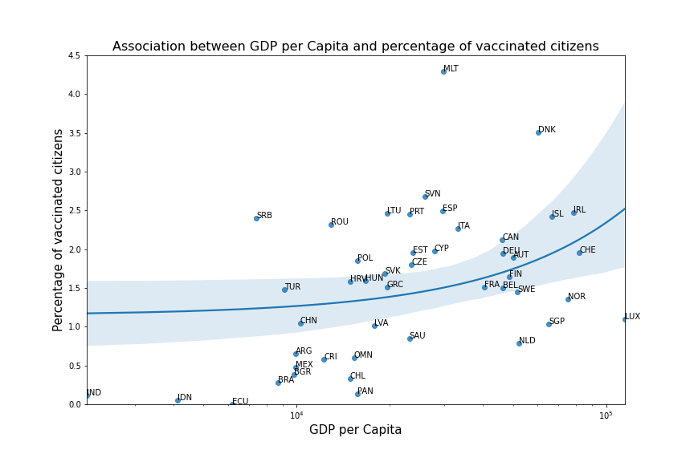
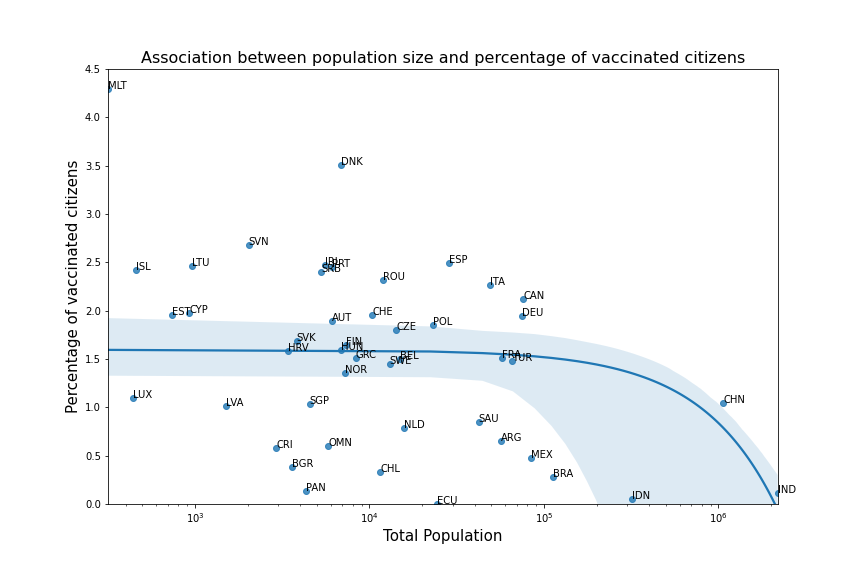
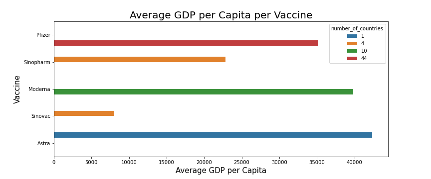

# Global Covid-19 Vaccination Progress

Countries all over the world face difficult challenges during their fight agains further Covid-19 spreading and try to protect their citizens as much as possible.
The currently released vaccines are the new hope in order to defeat the virus and every country is trying to vaccinate as much people as possible in a short amount of time.
This strategy brings new challenges with huge efforts needed in logistics and organisation. A race for vaccines has started between nations and million of people need to get vaccinated while prioritizing the risk groups.
But which countries are doing best compared globally? What influences the number of people that can get vaccinated daily? And do wealthy nations have easier access to the vaccines than others? These questions will be answered below.

The blog analyzes the progress of covid vaccination in different countries by investigation the [COVID-19 World Vaccination Progress Dataset](https://www.kaggle.com/gpreda/covid-world-vaccination-progress) from [Our World Data](https://ourworldindata.org/).
The data is enriched with [GDP per Capita Information](https://data.worldbank.org/indicator/NY.GDP.PCAP.CD) provided by the world bank and [country population information](https://population.un.org/wpp/Download/Standard/CSV/) provided by the United Nations.
The enriched dataset allows insights into the demographic and economic situations of the analysed countries and their progress on vaccinating their citizens.

## Results

**Association between GDP per Capita and percent of vaccinated citizens**

In a first step, the relationship between the Gross-Domestic-Product per Capita and the percentage of vaccinated people in a country was compared.
The results show that wealthy nations were able to vaccine a higher percentage of their citizens compared to other nations. This leads to the positively correlated regression line in the plot below. European countries such as Ireland or Denmark already achieved more than 2% while Mexico or Argentina get left behind behind.

**Association between population size and percent of vaccinated citizens**

The population size of a country is another difficult hurdle for a government. The complexity of the logistics grows with more people that need to be vaccinated.
The picture below was generated by comparing the population size against the percentage of vaccinated citizens.
It shows a straight line which then suddenly starts to drop. This indicates the fact that after a certain size it gets really hard for a gouvernment to coordinate the logistics.

**Vaccines Analysis: Are there vaccines mainly accessible for countries with a high GDP per Capita?**

Another interesting point is the availability of certain vaccines. The figure below shows the average GDP per capita of a country that uses a specific vaccine.
This plot allows to investigate, if a certain vaccine is better accessible for wealthy countries than others.
The Pfizer vaccine is used by a lot of countries but mainly from North America and Western Europe, while the vaccines Sinopharm and Sinovac are often used by countries from Eastern Europe or Asia.

